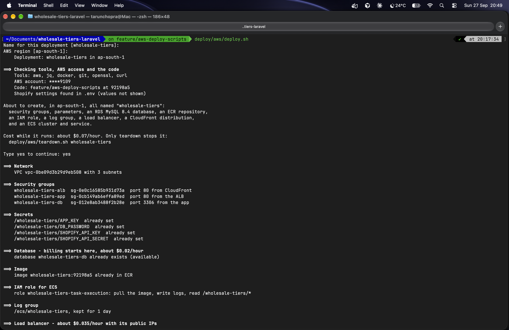
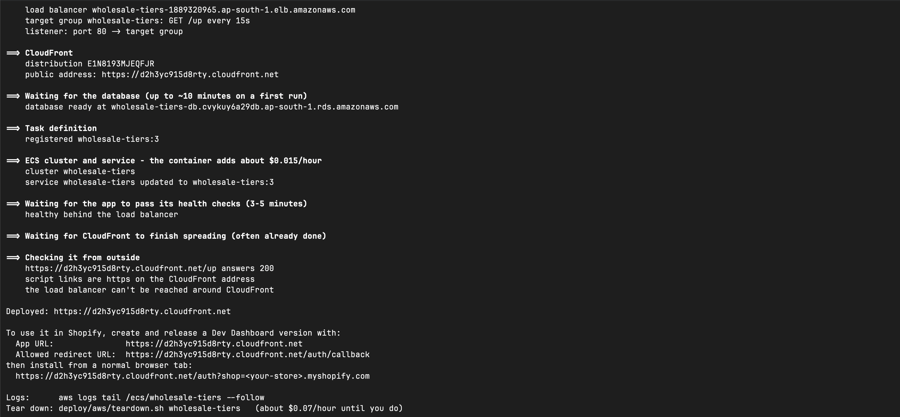
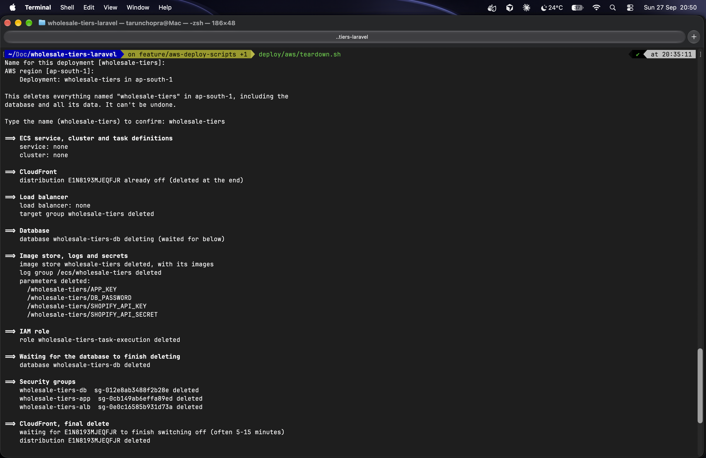
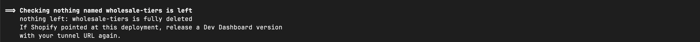

# wholesale-tiers

[](https://github.com/tarunchopra1012/wholesale-tiers-laravel/actions/workflows/tests.yml)

An embedded Shopify admin app that lets a merchant assign wholesale discount
tiers to customers by tag, preview the resulting prices, and have those
prices charged at checkout.

**Video walkthrough:** [Building a Shopify Wholesale Tier App POC](https://www.loom.com/share/5871db562af4475d8b162db5a70f9d1b) (Loom)

> **Status: early.** The development environment, the Laravel scaffold, the
> database layer, the OAuth install flow, session-token verification, the
> pricing logic with its unit tests, and all three pages — Customers,
> Settings and Price preview, in React and Polaris inside the admin — are in
> place. A merchant can create, rename and delete tiers, page through their
> customers, and price any product Shopify's own picker can find. Saved tiers
> are also applied at checkout, by a Shopify Function that Laravel keeps
> configured: on the development store a `wholesale-gold` customer paid 20%
> less for a snowboard. Each tier can carry a display name for checkout, the
> Settings page reports whether the discount is live, and GitHub Actions runs
> the tests on every pull request. The app has also
> been deployed to AWS — ECS Fargate behind a load balancer and CloudFront,
> with RDS MySQL — as a time-boxed demo, then deleted to avoid running costs;
> see [Deployment on AWS](#deployment-on-aws). The roadmap below marks
> honestly what exists and what doesn't.

## The problem it solves

Shopify's native B2B features — companies, price lists, catalogs — are
**Shopify Plus only**. Every merchant below Plus who sells wholesale fakes it
with customer tags: they tag one café `wholesale-gold`, another
`wholesale-silver`, and then have no built-in way to charge those customers
different prices.

This app closes that gap. It is a deliberately small version of what the
commercial wholesale-pricing apps do.

What a merchant can do with it:

1. See all customers grouped by wholesale tier
2. Define the tiers — add `wholesale-gold` at 20% off and `wholesale-silver`
   at 10% off, change either of them, or delete one
3. Preview the resulting price for any product, per tier
4. Have a tagged customer charged their tier's price at checkout, with
   nothing to type and no discount code

This is not a storefront, a theme, or a headless site. It is a tool inside
the merchant's admin; the only thing a shopper sees is the discount on their
cart.

## Stack

| Layer             | Choice                          | Version     |
| ----------------- | ------------------------------- | ----------- |
| Backend           | Laravel                         | 13.x        |
| Language          | PHP                             | 8.4         |
| Frontend          | React + TypeScript + Vite       | 18.x        |
| UI                | Shopify Polaris                 | latest      |
| Embedding         | App Bridge (CDN script)         | latest      |
| Database          | MySQL (local) · RDS MySQL (AWS) | 8.0 · 8.4   |
| Shopify Admin API | GraphQL                         | 2026-07     |
| Checkout logic    | Shopify Function (JavaScript → WebAssembly) | — |
| Function tooling  | Shopify CLI, on the host under Node 22+ | 4.x |
| Runtime (dev)     | Docker Compose                  | —           |
| Runtime (prod)    | One container: nginx + PHP-FPM under supervisord | — |
| Hosting (demo)    | AWS: ECS Fargate (ARM), ALB, CloudFront, RDS, ECR, Parameter Store, CloudWatch Logs | — |

## Architecture

Four rules shape the whole design:

1. **The Shopify access token never reaches the browser.** Every Admin API
   call originates in Laravel. There is no Shopify GraphQL in the React code.
   The checkout Function has no token either and makes no API calls.
2. **React talks to Laravel over plain REST JSON.** The only GraphQL in this
   codebase is the outbound query string Laravel sends to Shopify, and the
   Function's input query, which Shopify runs. No GraphQL server, no Apollo.
3. **Every API request carries a session ID token.** App Bridge attaches
   `Authorization: Bearer <jwt>` to same-origin `fetch` calls, and Laravel
   middleware verifies it on every request. No sessions, no cookies, no CSRF
   tokens on `/api/*`.
4. **One shop is one row.** The offline access token lives there, encrypted,
   and the shop is resolved from the ID token's `dest` claim — never from a
   query parameter the client controls.

Request flow:

```
Browser (React in the Shopify admin iframe)
  │  fetch /api/customers, Authorization: Bearer <ID token, ~60s TTL>
  ▼
Laravel  ── VerifyShopifySessionToken middleware
  │        verifies signature, aud and exp; resolves the shop from dest
  ▼
ShopifyGraphQLClient
  │  POST https://{shop}/admin/api/2026-07/graphql.json
  │  X-Shopify-Access-Token: {shop.access_token}
  ▼
Shopify Admin API
```

### Checkout: Laravel and the Function

The discount at checkout cannot run on this server: Shopify computes prices
on its own infrastructure. So the app has a second, much smaller program, a
Shopify Function in `extensions/wholesale-tier-discount/`, which Shopify runs
for every cart. The two never call each other. Laravel leaves the tiers where
the Function can read them: a JSON metafield on one automatic discount.

```
Merchant presses Save in Settings
  ▼
Laravel   saves tier_settings, then TierDiscountSync
  │         first time: creates the "Wholesale tiers" automatic discount
  │         every time: writes all tiers to its metafield
  ▼
Shopify   discount → metafield  $app:wholesale-tiers / function-configuration
  ▼         {"tags": [...], "tiers": [{"tag", "name", "type", "value"}]}
Function  runs on every cart: which tier tags does this customer have?
  ▼         each line gets the tier that takes the most off
Checkout  WHOLESALE GOLD (-$145.99)
```

- **Saving is publishing.** Every add, save and delete on the Settings page
  syncs; there is no separate step to forget.
- **A store needs one Save** before its first discount exists.
- **A customer in two tiers** gets the larger discount, line by line.
- **If Shopify refuses the sync,** the tiers stay saved and the page says
  checkout still has the previous ones.

The full design is in
[docs/how-checkout-discount-works.md](docs/how-checkout-discount-works.md).

### Data model

```
shops
  id, shop_domain (unique), access_token (encrypted cast),
  access_token_expires_at, refresh_token (encrypted cast),
  refresh_token_expires_at, scopes, installed_at,
  uninstalled_at (nullable), tier_discount_id (nullable),
  tier_discount_synced_at (nullable), timestamps

tier_settings
  id, shop_id (fk, cascade), tag, name (nullable), discount_type
  enum(percentage,fixed), discount_value decimal(10,2),
  badge_tone (a Polaris Badge tone), timestamps
  unique(shop_id, tag)
```

Two tables is the right size. There is deliberately **no `customers` table** —
customer data lives in Shopify, and caching it creates a sync problem this app
does not need.

Two details the shorthand above hides. `access_token` is a `text` column, not
`varchar(255)` — the `encrypted` cast stores a base64'd envelope of iv,
ciphertext and MAC, which takes a 38-character Shopify token to 256
characters, one past the limit. And `discount_type` casts to a `DiscountType`
enum rather than a bare string, so `TierCalculator` matches on cases instead
of string literals.

## Running it locally

Requires Docker Desktop. Nothing else — no PHP, Node or MySQL on your machine.

`.env` is not committed, so copy the example first:

```bash
cp .env.example .env
```

Its blank `DB_*` values are fine — compose passes the real ones into the
container. Then bring the stack up:

```bash
docker compose up -d --build
```

Generate the app key and create the tables:

```bash
docker compose exec app php artisan key:generate
docker compose exec app php artisan migrate --seed
```

`--seed` is optional. It gives every installed shop two tiers,
`wholesale-gold` at 20% off and `wholesale-silver` at 10% off — or, before
any store has installed the app, one stand-in shop to hold them. So after
installing on a store (below), seed again to give that store its tiers:

```bash
docker compose exec app php artisan db:seed --class=TierSettingSeeder
```

It only adds tiers a shop doesn't have, so it's safe to run again. It is a
convenience, not a requirement: a merchant can add their own tiers on the
Settings page.

| Service      | URL / Port              |
| ------------ | ----------------------- |
| App          | http://localhost:8000   |
| MySQL        | 127.0.0.1:3307          |

The `vite` container doesn't run a dev server. It builds the frontend into
`public/build` and rebuilds on every save, so after a change, wait a second
and refresh the app's frame in the admin. `localhost:8000` renders the page
too, but every API call there answers 401: only the admin can supply the ID
token.

Run artisan inside the container, not on the host:

```bash
docker compose exec app php artisan <command>
```

### API docs

Every `/api` endpoint is listed at
[localhost:8000/docs/api](http://localhost:8000/docs/api), and the raw
OpenAPI spec is at `/docs/api.json`. [Scramble](https://scramble.dedoc.co)
builds both from the routes, Form Requests and API Resources, so there are no
annotations to keep in step with the code: change a rule or a resource and the
docs change with it.

The page only opens when `APP_ENV=local`. It is for reading: "Send request"
needs an ID token, which only the Shopify admin can supply, and it expires in
about a minute.

### Installing on a development store

Shopify has to reach the app over HTTPS, so expose it with a tunnel:

```bash
cloudflared tunnel --url http://localhost:8000
```

Then:

1. In `.env`, set `SHOPIFY_API_KEY` (the Client ID) and `SHOPIFY_API_SECRET`
   (the Client secret) from the app's **App settings** page in the Dev
   Dashboard, and `SHOPIFY_APP_URL` to the tunnel URL.
2. In the Dev Dashboard, open **Versions → Create version**. Set the App URL
   to the tunnel URL, add `<tunnel url>/auth/callback` under Allowed
   redirection URL(s), keep Scopes the same as `SHOPIFY_SCOPES`, and click
   **Release**. A released version can't be edited; every change is a new
   version.
3. Visit `<tunnel url>/auth?shop=<your-store>.myshopify.com` in a normal
   browser tab — not inside the Shopify admin — and approve the install.

A quick tunnel gets a new URL every time it starts, so steps 1 and 2 repeat
on every restart.

**If Shopify says `The redirect_uri is not whitelisted` when the URL is
correct,** look for "dev previews" in the store admin's bottom corner. A
leftover preview from `shopify app dev` overrides the released version for
that store. Clear it with:

```bash
npx @shopify/cli@latest app dev clean --client-id=<client id> --store=<your-store>.myshopify.com
```

### The checkout Function

The Function is built and released with Shopify CLI, which runs on your
machine rather than in Docker and needs Node 22 or newer.

Run its tests. They build the Function and run every fixture in
`tests/fixtures/` against the WebAssembly; nothing touches Shopify:

```bash
cd extensions/wholesale-tier-discount
npm install
npx vitest run
```

Release it, from the repository root. `deploy` releases a whole app version
from `shopify.app.toml`, so first make sure the URLs in that file are the
current tunnel's:

```bash
shopify app deploy --allow-updates --message "What changed"
```

Then, in the store:

1. Open the app, go to **Tier settings** and press **Save**. The first save
   creates the "Wholesale tiers" discount; it then appears under
   **Discounts** in the admin.
2. On the storefront, log in as a customer tagged `wholesale-gold`, add a
   product to the cart and open checkout. The line shows the tier and the
   amount off.

**Never run `shopify app dev` against this app.** It creates the dev preview
described above, which overrides the released version for the store.

### Tests on every pull request

[.github/workflows/tests.yml](.github/workflows/tests.yml) runs two jobs on
every pull request, and on every push to `main`:

| Job                 | What it runs                                                        |
| ------------------- | ------------------------------------------------------------------- |
| `PHP suite`         | `php artisan test` on PHP 8.4, after type-checking and building the frontend |
| `Function fixtures` | builds the Function with Shopify CLI, then `npx vitest run`         |

Neither job needs a secret. The PHP suite uses in-memory SQLite and fakes
Shopify's answers, and Shopify CLI builds a Function without logging in.

### Setup notes worth knowing

A few things in this stack are easy to get wrong, and cost real time to
diagnose:

- **PHP must be 8.4 or newer.** Laravel 13 pulls in Symfony 8, which declares
  `php: >=8.4.1`. A PHP 8.3 base image installs fine and then fails at runtime
  in `vendor/composer/platform_check.php`, which is a confusing place to land.
- **The database settings come from `docker-compose.yml`, not `.env`.**
  Compose passes `DB_*` in as real environment variables, and Laravel's dotenv
  loader never overwrites a variable that already exists in the environment.
  Both files are kept in sync so this can't surprise you.
- **`APP_KEY` has to exist before anything writes a shop row.**
  `shops.access_token` uses Laravel's `encrypted` cast, so a missing key fails
  with `No application encryption key has been specified` — at seed time
  rather than at migrate time, which makes it look like a seeder bug.
- **Inside the admin, the page can't load scripts from the Vite dev server.**
  The page comes from the public tunnel address and the dev server is on
  `localhost:5173`; browsers block that. The symptom is a blank frame. That's
  why the `vite` container builds files instead. If `public/hot` is left over
  from a dev server, delete it — while it exists, Laravel points the page at
  `localhost:5173`.
- **The watch build can miss a saved file.** If the admin still shows the old
  page after a React change, run `docker compose exec vite npm run build`.
- **The watch build stops for good if its entry file disappears**, for example
  during a branch switch. It logs `Cannot resolve entry module` and never
  rebuilds, while the admin keeps showing the last good build. Fix it with
  `docker compose restart vite`.
- **Shopify's product picker only exists inside the admin.** The admin draws
  it, so on `localhost:8000` there is no `window.shopify` and the Preview
  page's Choose product button answers with a red banner. The prices
  themselves still work there, because Laravel reads them from Shopify.
- **Laravel trusts the tunnel's `X-Forwarded-Proto` header.** The tunnel
  reaches nginx over plain HTTP. Without that trust, Laravel writes `http://`
  script links into an `https` page, and Chrome blocks them as mixed content —
  another blank frame. Firefox loaded them anyway, so it can look fixed when it
  isn't.

## Deployment on AWS

The production image is deployed to AWS in the Mumbai region (`ap-south-1`)
as a time-boxed demo. Two scripts in `deploy/aws/` create the whole stack and
delete it again, and it is deleted after each demo to avoid running costs, so
there is no live URL.

```
Merchant's browser (Shopify admin iframe)
  │  https://<distribution>.cloudfront.net
  ▼
CloudFront          caching off; every header passed through, incl. Authorization
  │  HTTP :80
  ▼
Application Load Balancer   accepts CloudFront's origin-facing addresses only
  │  health check: GET /up every 15s
  ▼
ECS Fargate task    ARM64, 0.25 vCPU / 0.5 GB, image from ECR
  │  on start: cache config/routes/views → wait for DB → migrate → nginx + PHP-FPM
  │  secrets injected from SSM Parameter Store; logs to CloudWatch
  ▼
RDS MySQL 8.4       db.t4g.micro, not publicly accessible
```

### Deploying and tearing down

```bash
deploy/aws/deploy.sh [name]      # asks for a name (default wholesale-tiers) and a region (default ap-south-1)
deploy/aws/teardown.sh [name]    # asks you to type the name back before deleting anything
```

They need the AWS CLI v2 signed in with administrator rights, Docker and
`jq`, and they run from the repository root. The Shopify key, secret and
scopes come from `.env`; the app key and the database password are generated
and kept in Parameter Store. The scripts are written for the bash 3.2 that
macOS ships.

**`deploy.sh`** checks the tools, the AWS login and that the app's code is
committed, then asks for `yes` before creating anything that costs money. It
creates the security groups, parameters, database, image, IAM role, log
group, load balancer, CloudFront distribution and ECS service, waits until
the load balancer sees a healthy task, and finishes with three checks from
outside: `/up` answers `200` over https, the page's script links are
`https://` on the CloudFront address, and the load balancer can't be reached
directly.

- **Every resource is named from the one name**, so the two scripts always
  agree on what belongs to a deployment.
- **Each step looks before it creates.** A run that failed halfway carries on
  where it stopped; a run against a healthy stack changes nothing but the app.
- **A re-run is a redeploy.** It registers a new task definition revision and
  ECS starts the new task, waits for it to pass its health checks, then stops
  the old one — no downtime. The image is tagged with the last commit outside
  `deploy/`, so it's only rebuilt when the app changes.
- **A deployment that keeps failing stops** (ECS's circuit breaker) instead
  of restarting containers indefinitely.

**`teardown.sh`** finds each resource by its name, deletes them in dependency
order, skips anything already gone, retries where AWS takes a moment to
release something, and ends by checking that nothing with that name is left.
It is safe to run again after an interrupted run.

**Cost:** about $0.07 an hour while the stack exists. The first demo, up for
about an hour and a half, came to $0.14 on the AWS bill.

### What each piece is for, and why it was chosen

| Piece | Why |
| --- | --- |
| **CloudFront** | Shopify requires an `https://` App URL. With no custom domain, CloudFront's default certificate provides it. The managed `CachingDisabled` policy means nothing is stored, so one shop's response can never be served to another; the managed `AllViewer` policy forwards the `Authorization` header that carries the session token |
| **Load balancer** | Health checks against `/up`, and the standard front of an ECS service. Its security group admits only CloudFront's managed prefix list, so the app can't be reached around CloudFront |
| **ECS on Fargate, ARM64** | No server to patch. ARM is cheaper per hour, and builds natively on an Apple-silicon Mac |
| **RDS MySQL 8.4** | A managed database, reachable only from the app's security group. 8.4 rather than 8.0: RDS MySQL 8.0 left standard support on 31 Jul 2026 and now carries an Extended Support surcharge |
| **SSM Parameter Store** | `APP_KEY`, the DB password and the Shopify credentials are stored encrypted and injected as environment variables at start. The task's IAM role can read `/<name>/*` and nothing else. They never appear in the image, the task definition or git |
| **No NAT gateway** | The task has a public IP to reach Shopify and ECR; its security group still admits only the load balancer. Avoids the NAT gateway's hourly charge |

Security groups chain one layer to the next: CloudFront → load balancer
(port 80) → app (port 80, from the load balancer's group) → database (port
3306, from the app's group).

### What the container does on start

`docker/entrypoint.sh` caches config, routes and views (at start, not at
build, because `config:cache` freezes environment values that only exist at
run time), waits up to 60 s for the database, runs `migrate --force`, then
hands over to supervisord. `/up` is Laravel's built-in health route plus a
listener that runs `select 1`, so the load balancer marks the task unhealthy
if the database is unreachable.

One code change was needed for AWS: behind CloudFront, the load balancer
reports each request as `http`, so Laravel would write `http://` asset links
into an `https` page. `AppServiceProvider` forces the https scheme whenever
`APP_URL` is `https://`; local runs keep an `http://` `APP_URL` and are
unaffected.

### Verified on the running stack

- The container's logs showed the six migrations running on the new RDS
  database, then nginx and PHP-FPM starting.
- The load balancer's health checks answered `200` every 15 seconds, from
  two availability zones.
- `GET /up` through CloudFront answered `200` with `{"status":"up"}` over
  HTTPS.
- The page's asset links were `https://` on the CloudFront domain.
- A direct request to the load balancer timed out: it only accepts
  CloudFront.
- On 27 Sep the scripts ran the full cycle: a deploy from nothing, a second
  run that reused every resource and redeployed the app without downtime,
  and a teardown that, after one re-run, ended with nothing named
  `wholesale-tiers` left.

#### Terminal output from the 27 Sep run

**`deploy.sh` run against a stack that already existed:** every resource
found and reused, the image not rebuilt, the service moved to task
definition revision 3, then healthy, then the three outside checks.





**`teardown.sh`, the re-run that finished the job.** The first run had
deleted the service, cluster and load balancer, then stopped at the target
group, so this one starts with those as `none`.





### Honest scope — what a real production setup would add

This was a demo deployment, and it is not production-hardened:

- **Bash scripts over the AWS CLI, not infrastructure as code** (Terraform or
  CDK). They find what exists by looking it up by name on every run instead
  of keeping state, and there's **no CI/CD** — the image is built and pushed
  from a laptop.
- **One task, a single-AZ database, automated backups off.**
- **Migrations run on container start.** Fine for one task; before scaling
  out they belong in a one-off task.
- **No custom domain.** A domain with an ACM certificate on the load balancer
  would remove the need for the https workaround above.
- **Laravel trusts `X-Forwarded-Proto` from any proxy.** Acceptable here only
  because the app's security group admits nothing but the load balancer.
- **The health check queries the database.** Right for one container; with
  many, a brief database problem would fail every task at the same moment.

## Roadmap

Built:

- [x] Dockerised dev environment — php-fpm, nginx, MySQL 8, Vite
- [x] Laravel 13 scaffold on PHP 8.4, MySQL wired up
- [x] Data layer — `shops` and `tier_settings` migrations, models, factories
  and a development seeder
- [x] OAuth install flow — shop-domain check, HMAC and one-time nonce
  verification, expiring offline token stored encrypted
- [x] Session-token verification middleware — ID token checked on every
  `/api` request, shop taken from the token's `dest` claim
- [x] `ShopifyGraphQLClient` with token refresh (one shop at a time, under a
  lock) and throttle retries, and the first `/api/customers` endpoint
- [x] React + Polaris + App Bridge shell, with client-side routes for
  Customers, Settings and Preview
- [x] Customers page — `IndexTable` with name, email, tier badges and
  location, filtered by any of the shop's own tiers, 25 at a time with Next
  and Previous
- [x] `TierCalculator` — percentage or fixed discount in whole cents, exact
  decimal arithmetic, never below zero, rounded half-up; unit-tested
- [x] `GET`, `POST`, `PUT` and `DELETE` on `/api/tiers`, plus
  `GET /api/products`, `GET /api/preview` and `GET /api/checkout-status`
- [x] Settings page — a card per tier, percentage or fixed amount, all saved
  in one request, errors shown under the field; tiers can be added, renamed
  and deleted, with the delete confirmed first
- [x] Price preview — choose any product with Shopify's own picker, see its
  base price and each tier's price
- [x] Tiers applied at checkout — a Shopify Function that reads the shop's
  tiers from a discount metafield, tested with fixtures against the built
  WebAssembly; Laravel creates the discount and rewrites the metafield on
  every tier change
- [x] A display name per tier — optional, shown at checkout, on the Customers
  badge and in the Price preview; the tag still decides who gets the tier
- [x] A badge colour per tier, chosen in Settings from Polaris's seven tones
- [x] Checkout status on the Settings page — says whether the "Wholesale
  tiers" discount is active, switched off, deleted or never set up, from
  `GET /api/checkout-status`
- [x] CI on GitHub Actions — the PHP suite and the Function's fixtures run on
  every pull request and every push to `main`
- [x] API docs — generated OpenAPI at `/docs/api` with Scramble, local only
- [x] Production image — `.dockerignore`, a start-up entrypoint (cache,
  wait for the database, migrate), a `/up` health check that includes the
  database, logs to stdout
- [x] Deployed to AWS as a demo — ECS Fargate, ALB, CloudFront, RDS MySQL
  8.4, Parameter Store — then deleted (see
  [Deployment on AWS](#deployment-on-aws))
- [x] One-command deploy and teardown scripts (`deploy/aws/`) — safe to
  re-run, a re-run redeploys without downtime, and teardown ends by checking
  nothing is left

Not built yet. The first group is the next stage of work; each later group
builds on the one before it.

Next — write to Shopify, and listen to it (needs the `write_customers` scope):

- [ ] Change a customer's tier from the app, instead of tagging by hand in
  the admin
- [ ] An audit log of tier changes: who changed what, and whether it reached
  checkout
- [ ] Webhooks — `app/uninstalled` and the three compliance topics

Later — scale, richer rules, and the storefront:

- [ ] Assign a tier to many customers at once, in the background
- [ ] Tier rules: a minimum order value and excluded collections
- [ ] Show the wholesale price on the product page, which needs a theme app
  extension

Later still — AI features, and proof at scale:

- [ ] AI tier suggestions, approved by the merchant
- [ ] Set up tiers in plain English
- [ ] An impact summary before saving
- [ ] Ask questions about your wholesale customers
- [ ] Run all of it against a store with 100,000 customers

Known gaps in what is built:

- [ ] The checkout status says "up to date" even after a save whose sync to
  Shopify failed; fixing it needs a record of the failed sync
- [ ] Two saves at the same moment on a shop with no discount yet could both
  create one

Deployment:

- [ ] Infrastructure as code and a deploy pipeline for the AWS deployment
- [ ] A custom domain with an ACM certificate on the load balancer

## Deliberately out of scope

The exclusions are as considered as the build. Two of them are postponed, not
ruled out: they are on the roadmap above.

| Excluded | Why | Status |
| --- | --- | --- |
| Theme app extension | A display concern on the storefront, separate from the pricing engine | Postponed: needed to show the wholesale price on the product page |
| Webhooks (`app/uninstalled`, the three compliance topics, `customers/update`) | Production hygiene — without `app/uninstalled`, a dead token stays in the database — but infrastructure that does not change what the app demonstrates | Postponed: `app/uninstalled` and the compliance topics are in the next stage. `customers/update` is not planned, because the app keeps no copy of customers to update |
| Billing API, multi-store support | These only matter for public App Store distribution | Not planned |
| Broad test coverage | Tests cover only the places where a bug would be a security hole or a silent failure: the OAuth HMAC check, session-token verification, the middleware's shop resolution, token refresh, the throttle retry, `TierCalculator` — 0%, 100%, a fixed discount bigger than the price, and rounding at the half cent — and the checkout path: `TierDiscountConfig`, `TierDiscountSync` against faked Shopify answers, and the Function's fixtures. Controllers, views and the happy path through Shopify are checked by hand against a development store. | Not planned. CI runs these tests on every pull request; it adds none |

## License

MIT
